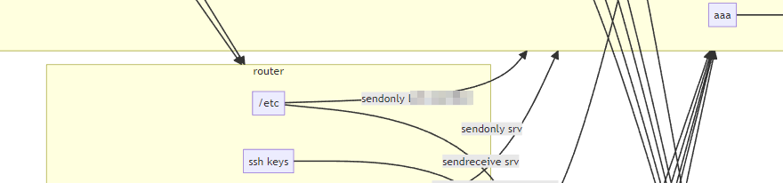
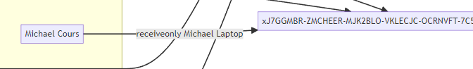

# syncthing-map

A utility to map syncthing devices and shared folders

## Usage

Run the following command repetedely for each `config.xml` you have access to ([how to find it](https://docs.syncthing.net/users/config.html))

    syncthing-map add --device <name of the device you took the config.xml from> --file <copied config.xml, possibly renamed>

An example of what you should see (with two devices/configs) is

```text
PS D:\syncthing-map> .\syncthing-map.exe add --device srv --file config-srv.xml
2023-01-09T19:46:02+01:00 INF wrote data.json file
PS D:\syncthing-map> .\syncthing-map.exe add --device router --file config-router.xml
2023-01-09T19:46:16+01:00 INF wrote data.json file
```

This added (or updated) two devices to the database file. This file (`data.json` by default) will be initially created if absent, then updated with each `add` command. It gathers relevant information about each of the devices and its folders. The more you run `syncthing-map add`, the better your map will be - otherwise you will see that you are sharing fildes with a crazily named thing (this is the ID of the remote device).

When you are done with adding devices/configurations, run

    syncthing-map graph

This will create `syncthing-map.html` that you can open with a browser. If everything went well, you should see a comprehensive map of your devices and their folders.



In the example above, you see a yellow rectange titled `router`. This a device. Its name comes from the `--device` parameter avove and its contents were generated based on the `config.xml` from that device.

It has two folders named `/etc` and `ssh keys`. They correspond to actual folders on your filesystem but the path is not shown here.

The way to read an arrow going from a folder is

> (folder) is connected as (`sendreceive`, `sendonly`, `receiveonly`) to (device)

In the case of the folder called `/etc`, it is shared in a `sendonly` mode with the device (redacted), and in the mode `sendreceive` with the device `srv`.

This is what you will see when sharing folders with a device that has not be "read" (its `config.xml` file was not added)



This means that `Michael Cours` shared by a device (the name is not visible) is connected to a device that has not been processed (only known by its ID). This device is however defined in other `config.xml` files as `Michael Laptop` so the probable name is provided.

It may be that on that this unprocessed device has given itself another name. We will not know until its `config.xml` file is processed.

## TODO

- a service to provide always up-to-date graphs
- a CI/CD workflow (GitHib Actions) to magically build plenty of executables and whatnot
- add credits in the generated file


## What next?

This is a hobby project done follwong some [discussions on the Synthing forum](https://forum.syncthing.net/t/how-to-graph-my-clients/19554).

Feel free to open Issues if you find bugs, or start Discussions.

I should probbaly add a license but I do not care, so let it be [WTFPL](https://en.wikipedia.org/wiki/WTFPL).

If you have the irrestible need to share your gratitude, call someone you love or send money to a clever charity that helps with education.
